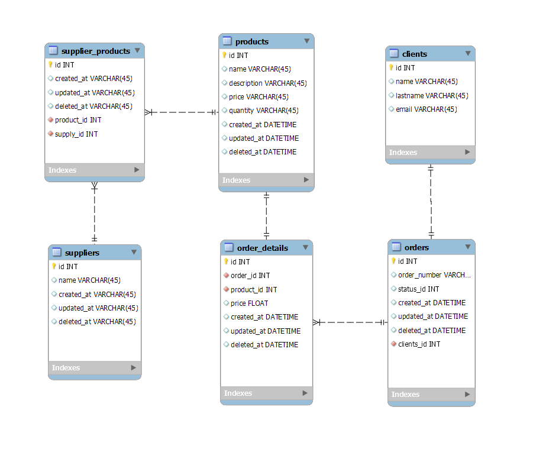
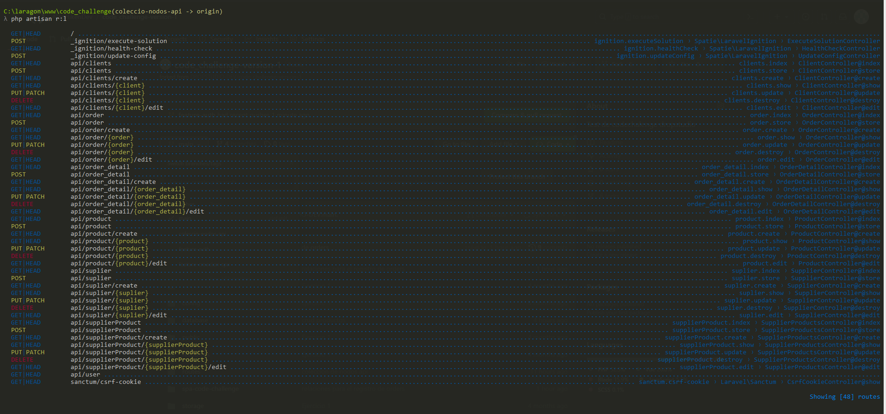
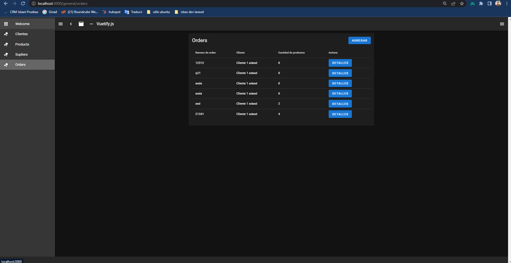

# Code Challenge

### Laravel API Rest VueJS SPA  [Dificultad: Baja]

#### CODE CHALLENGE

#### Instrucciones:

1. Crear colección de nodos API Rest del siguiente diagrama ER (Ver imagen).
2. Crear una aplicación SPA con VueJS que consuma y pueda interacturar con todos los métodos cruds de la API Rest. (Considerar las siguientes pantallas en la aplicación SPA: Registro, Iniciar sesión, Confirmación de correo electrónico, Restablecer contraseña)
3. Proteger las rutas con sanctum o con JWT y justificar la implementación seleccionada.
4. Elige algún motor de base de datos para almacenar los datos (Postgres, Mysql, MariaDB, MSSQL)de la API Rest y justifica la elección.
5. Versiona el código y cada uno de los pasos siguiendo la convención de Gitflow Workflow.
6. Documentar API Rest con Swagger.
7. Publicar API Rest y Aplicación SPA en alguna capa gratuita: Heroku, Elastic Beanstalk AWS, Render, Firebase, etc. y agregar url en readme del proyecto.

#### Nota:
Se evaluarán las prácticas en código, por lo tanto, tienes la oportunidad de ser seleccionado si demuestras habilidades
con pruebas unitarias, implementación de patrones de diseño para reutilizar código, dominio general del proceso de desarrollo e implementación.

Al finalizar compartir url del repositorio por whatsapp al siguiente contacto:
- Teléfono: 3325154811
- Email: mario@dropstudio.mx

#### Resultados :

1. creacion de nodos api -> rama :coleccion-nodos-api
   La creacion de los nodos api incluye la creacion de los modelos, las migraciones, un seeder para un usuario y las acciones crud de cada modelo 
   Aunque no era necesario crear el crud de todos los modelos se agregaron  
   # Cosas a mejorar :
    - Los controladores no estan validados por una clase request especifica para cada modelo 
    - Los modelos no tiene proteccion 
    - Se agregaron los campos de softdelete pero la eliminacion se hace de con el metodo delete falta remplazar 
    - verificar integridad de las relaciones (tambien se resuelve con los softdeletes)
   # Puntos fuertes 
    - Cumple con los requisitos del desafio
    - Las migraciones aseguran las relaciones de la base de datos
    - Los modelos incluyen las relaciones del diagrama

       

2. La aplicion spa esta contruida con nuxtjs esta en la carpeta spa-code-challenge vuetify
   rama :feature-creacion-spa
   # Puntos fuertes : 
   - Es una spa independiete por lo que no necesita de los mixins de laravel
   - Se usan los paquetes mas comunes de vue como vuex, router
   - Los componentes son reutilizables
   
    

3. Escogi protejer las rutas con Sanctum es uno de los paquetes mas populares de laravel 
   Brinda una facil integracion y trabajr con los tokens de sanctum es mas facil y dinamico 
   rama :feature-auth

4. Escogi mysql como motor de base de datos por su integracion con laravel 
    - al ser de codigo abierto es facil entederlo y mantenerlo con el paso del tiempo 
    - Tiene un alto rendimiento y escalabilidad
    - Mysql admite una diversidad de motores como innodb o myIsam

5. En mi fork de este proyecto 
   maneje cada punto en una rama diferente al finalizar cada tarea las mezclaba en main la rama principal
   Por lo general lo recomendable es realizar una solicitud pull request para mezclar las ramas 
   pero para fines de este ejercicio solo mezcle las ramas   

#### CODE CHALLENGE

Gracias por su atencion !! 